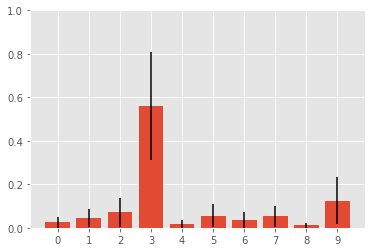
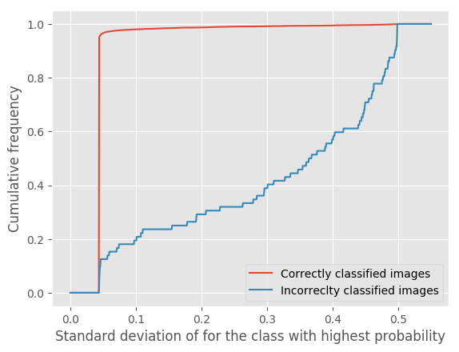
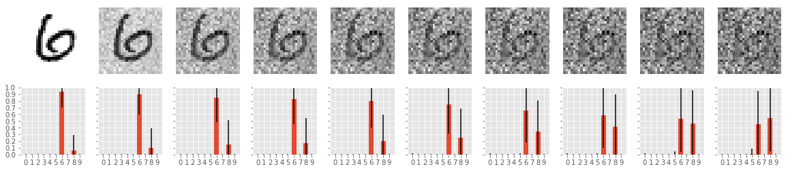

# CNN uncertainty with Gaussian processes

Convolutional neural networks (CNNs) achieve state-of-the-art performance on image classification tasks, but provide no measure of confidence in their predictions. I implement and analyse on way to obtain confidence or uncertainty bounds in their predictions: After training a CNN, I use the outputs from the top level feature layer before the softmax classifier to train a Gaussian Process classifier on the MNIST data. 

Hence, instead of just obtaining a probability for each class, we also get a standard deviation associated with each probability. 

## Code
<Warning>Warning: This code was produced for a project with a tight deadline and is therefore not cleaned up and could do with a lot of refactoring...</Warning>

The entry point to train and evaluate this approach can be found in [GP_uncertainty_on_mnist.py](GP_uncertainty_on_mnist.py). The other contain code for visualization and for a more in depth analysis of the results.

## Results
All results are reported in my written report [link](report/report.pdf).

The two main results are summarized below.

### MNIST uncertainty
The model's uncertainty is much higher for the missclassified images. This can be explained by the fact that these images are ambiguous, even for humans.

### Uncertainty on noisy images
The uncertainty increases as more noise is added to the input

